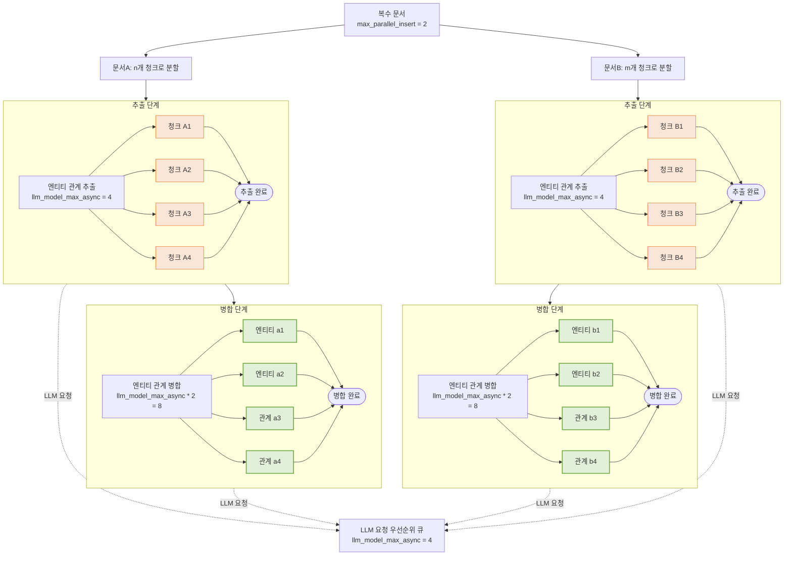

# LightRAG 다중 문서 처리: 동시성 제어 전략

LightRAG는 여러 문서를 처리할 때 다층적인 동시성 제어 전략을 사용합니다. 이 문서에서는 문서 수준, 청크 수준, LLM 요청 수준의 동시성 제어 메커니즘을 심층적으로 분석하여, 특정 동시성 동작이 발생하는 이유를 이해할 수 있도록 도와줍니다.

## 1. 문서 수준 동시성 제어

**제어 파라미터**: `max_parallel_insert`

이 파라미터는 동시에 처리되는 문서 수를 제어합니다. 과도한 병렬성이 시스템 자원을 과부하시켜 개별 파일의 처리 시간이 늘어나는 것을 방지하는 것이 목적입니다. 문서 수준 동시성은 LightRAG 내의 `max_parallel_insert` 속성으로 제어되며, 기본값은 2이고 `MAX_PARALLEL_INSERT` 환경 변수로 설정할 수 있습니다.

`max_parallel_insert`는 2에서 10 사이로 설정하는 것을 권장하며, 일반적으로 `llm_model_max_async/3`이 적절합니다. 이 값을 너무 높게 설정하면 병합 단계에서 서로 다른 문서 간의 엔티티 및 관계 이름 충돌 가능성이 증가하여 전체 효율성이 감소합니다.

## 2. 청크 수준 동시성 제어

**제어 파라미터**: `llm_model_max_async`

이 파라미터는 문서 내 추출 단계에서 동시에 처리되는 청크 수를 제어합니다. 대량의 동시 요청이 LLM 처리 자원을 독점하여 여러 파일의 효율적인 병렬 처리를 방해하는 것을 방지하는 것이 목적입니다. 청크 수준 동시성은 기본값이 4이고 `MAX_ASYNC` 환경 변수로 설정 가능한 `llm_model_max_async` 속성으로 제어됩니다.

`extract_entities` 함수에서 **각 문서는 독립적으로** 자체 청크 세마포어를 생성합니다. 각 문서가 독립적으로 청크 세마포어를 생성하기 때문에 시스템의 이론적 청크 동시성은:

$$
청크 동시성 = 최대 병렬 삽입 × LLM 모델 최대 비동기
$$

예시:
- `max_parallel_insert = 2` (2개 문서 동시 처리)
- `llm_model_max_async = 4` (문서당 최대 4개 청크 동시 처리)
- 이론적 청크 수준 동시성: 2 × 4 = 8

## 3. 그래프 수준 동시성 제어

**제어 파라미터**: `llm_model_max_async * 2`

이 파라미터는 문서 내 병합 단계에서 동시에 처리되는 엔티티 및 관계 수를 제어합니다. 엔티티 관계 병합 단계는 모든 연산에 LLM 상호작용이 필요하지 않으므로, 병렬성이 LLM 병렬성의 두 배로 설정됩니다. 이는 과도한 LLM 큐 경합을 방지하면서 기계 활용도를 최적화합니다.

그래프 수준 병렬성 제어 파라미터는 문서 삭제 후 엔티티 관계 재구축 단계의 병렬성 관리에도 동일하게 적용됩니다.

## 4. LLM 수준 동시성 제어

**제어 파라미터**: `llm_model_max_async`

이 파라미터는 문서 추출 단계, 병합 단계, 사용자 쿼리 처리를 포함한 전체 LightRAG 시스템에서 발송되는 LLM 요청의 **동시 볼륨**을 제어합니다.

LLM 요청 우선순위는 전역 우선순위 큐로 관리되며, **사용자 쿼리를 체계적으로 병합 관련 요청보다 우선**하고, 병합 관련 요청은 추출 관련 요청보다 우선합니다. 이 전략적 우선순위 지정은 **사용자 쿼리 지연시간을 최소화**합니다.

## 5. 완전한 동시성 계층 다이어그램

> 추출 단계와 병합 단계는 `llm_model_max_async`로 규제되는 전역 우선순위 LLM 큐를 공유합니다. 많은 수의 엔티티 및 관계 추출/병합 연산이 "활성 처리 중"일 수 있지만, **제한된 수만이 동시에 LLM 요청을 실행**하며 나머지는 대기합니다.

## 6. 성능 최적화 권장 사항

### LLM 서버 또는 API 제공자의 능력에 따라 LLM 동시성 설정 증가

파일 처리 단계에서 LLM의 성능 및 동시성 능력이 주요 병목입니다. LLM을 로컬에 배포할 때 서비스의 동시성 용량은 LightRAG의 컨텍스트 길이 요구사항을 충분히 고려해야 합니다. LightRAG는 LLM이 최소 32KB 컨텍스트 길이를 지원하도록 권장하므로 이 기준으로 서버 동시성을 계산해야 합니다. API 제공자의 경우 동시 요청 제한으로 클라이언트 요청이 거부되면 LightRAG는 최대 3번 재시도합니다. 백엔드 로그에서 LLM 재시도가 발생하는지 확인하면 `MAX_ASYNC`가 API 제공자의 제한을 초과했는지 알 수 있습니다.

### 병렬 문서 삽입 설정을 LLM 동시성 설정에 맞춤

권장하는 병렬 문서 처리 작업 수는 LLM 동시성의 1/4로, 최소 2, 최대 10입니다. 더 많은 병렬 문서 처리 작업을 설정한다고 해서 전체 문서 처리 속도가 빨라지지 않습니다. 소수의 동시 처리 문서로도 LLM의 병렬 처리 능력을 완전히 활용할 수 있기 때문입니다. 과도한 병렬 문서 처리는 각 개별 문서의 처리 시간을 크게 증가시킬 수 있습니다. LightRAG는 파일 단위로 처리 결과를 커밋하므로, 동시 파일이 많으면 대량의 데이터를 캐시해야 합니다. 시스템 오류 발생 시 중간 단계의 모든 문서를 다시 처리해야 하므로 오류 처리 비용이 증가합니다.

예시: `MAX_ASYNC`가 12로 설정된 경우 `MAX_PARALLEL_INSERT`를 3으로 설정하는 것이 적절합니다.
